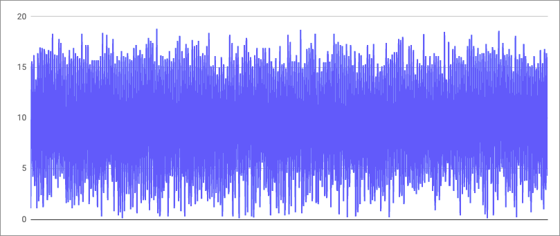
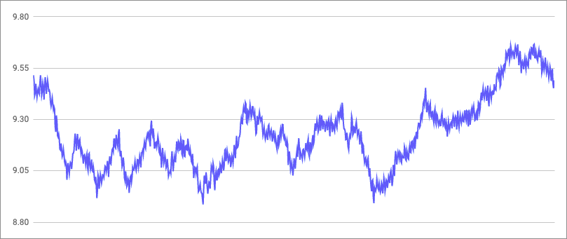

# ASAP Smoothing [<sup><mark>experimental</mark></sup>](/docs/README.md#tag-notes)

> [Description](#asap-description)<br>
> [Details](#asap-details)<br>
> [Example](#asap-example)<br>
> [API](#asap-api)

## Description <a id="asap-description"></a>

The [ASAP smoothing alogrithm](https://arxiv.org/pdf/1703.00983.pdf) is designed create human readable graphs which preserve the rough shape and larger trends of the input data while minimizing the local variance between points.  TimescaleDB Toolkit provides an implementation of this which will take `(timestamp, value)` pairs, normalize them to the target interval, and return the ASAP smoothed values.

## Details <a id="asap-details"></a>

Timescale's ASAP smoothing is implemented as a PostgresQL aggregate over a series of timestamps and values, with an additional target resolution used to control the output size.  The implementation will take the incoming data and attempt to bucket the points into even sized buckets such the number of buckets approximates the target resolution and each bucket contains a similar number of points (if necessary, gaps will be filled by interpolating the buckets on either side at this point).  It will then attempt to identify good candidate intervals for smoothing the data (using the Wiener-Khinchin theorem to find periods of high autocorrelation), and then choose the candidate that produces the smoothest graph while having the same degree of outlier values.

The output of the postgres aggregate is a timescale timeseries object describing the start and step interval times and listing the values.  This can be passed to our `unnest` API to produce a table of time, value points.  The aggreates are also currently not partializeable or combinable.

## Usage Example <a id="asap-example"></a>

In this example we're going to examine about 250 years of monthly temperature readings from England (raw data can be found [here](http://futuredata.stanford.edu/asap/Temp.csv), though timestamps need to have a day added to be readable by PostgresQL).


```SQL ,ignore
CREATE TABLE temperatures(month TIMESTAMPTZ, value DOUBLE PRECISION);
COPY temperatures from 'temperature.csv' CSV HEADER;
SELECT * FROM temperatures ORDER BY month LIMIT 10;
```
```
            month             | value
------------------------------+-------
 1723-01-01 00:00:00-07:52:58 |   1.1
 1723-02-01 00:00:00-07:52:58 |   4.4
 1723-03-01 00:00:00-07:52:58 |   7.5
 1723-04-01 00:00:00-07:52:58 |   8.9
 1723-05-01 00:00:00-07:52:58 |  11.7
 1723-06-01 00:00:00-07:52:58 |    15
 1723-07-01 00:00:00-07:52:58 |  15.3
 1723-08-01 00:00:00-07:52:58 |  15.6
 1723-09-01 00:00:00-07:52:58 |  13.3
 1723-10-01 00:00:00-07:52:58 |  11.1
(10 rows)
```

It is hard to look at this data and make much sense of how the temperature has changed over that time.  Here is a graph of the raw data:



We can use ASAP smoothing here to get a much clearer picture of the behavior over this interval.

```SQL ,ignore
SELECT * FROM toolkit_experimental.unnest((SELECT toolkit_experimental.asap_smooth(month, value, 800) FROM temperatures));
```
```
                time                 |       value
-------------------------------------+-------------------
 1723-01-01 00:00:00-07:52:58        |  9.51550387596899
 1723-04-12 21:38:55.135135-07:52:58 |   9.4890503875969
 1723-07-23 19:17:50.27027-07:52:58  |  9.41656976744186
 1723-11-02 16:56:45.405405-07:52:58 | 9.429360465116277
 1724-02-12 14:35:40.54054-07:52:58  | 9.473546511627905
 1724-05-24 12:14:35.675675-07:52:58 | 9.439341085271316
 1724-09-03 09:53:30.81081-07:52:58  | 9.409496124031007
 1724-12-14 07:32:25.945945-07:52:58 | 9.435465116279067
 1725-03-26 05:11:21.08108-07:52:58  |  9.44864341085271
 1725-07-06 02:50:16.216215-07:52:58 |  9.43003875968992
 1725-10-16 00:29:11.35135-07:52:58  | 9.423062015503874
 1726-01-25 22:08:06.486485-07:52:58 |  9.47771317829457
 1726-05-07 19:47:01.62162-07:52:58  | 9.515310077519377
 1726-08-17 17:25:56.756755-07:52:58 |  9.47383720930232
...
```

Note the use of the `unnest` here to unpack the results of the `asap_smooth` command.  The output of this command is ~800 points of smoothed data (in this case it ended up being 888 points each representing a rolling moving average of about 21.5 years).  We can view of graph of these values to get a much clearer picture of how the temperature has fluctuated over this time:




## Command List (A-Z) <a id="asap-api"></a>
> - [asap_smooth](#asap_smooth)

---
## **asap_smooth** <a id="asap_smooth"></a>
```SQL ,ignore
toolkit_experimental.asap_smooth(
    ts TIMESTAMPTZ,
    value DOUBLE PRECISION,
    resolution INT
) RETURNS NormalizedTimeSeries
```

This normalize time, value pairs over a given interval and return a smoothed representation of those points.

### Required Arguments <a id="asap-required-arguments"></a>
|Name| Type |Description|
|---|---|---|
| `ts` | `TIMESTAMPTZ` | Column of timestamps corresponding to the values to aggregate |
| `value` | `DOUBLE PRECISION` |  Column to aggregate. |
| `resolution` | `INT` |  Approximate number of points to return.  Intended to represent the horizontal resolution in which the aggregate will be graphed
<br>

### Returns

|Column|Type|Description|
|---|---|---|
| `normalizedtimeseries` | `NormalizedTimeSeries` | A object representing a series of values occurring at set intervals from a starting time.  It can be unpacked via `unnest` |
<br>

### Sample Usages <a id="asap-examples"></a>
For this examples assume we have a table 'metrics' with columns 'date' and 'reading' which contains some interesting measurment we've accumulated over a large interval.  The following example would take that data and give us a smoothed representation of approximately 10 points which would still show any anomolous readings:

<div hidden>

```SQL ,non-transactional
SET TIME ZONE 'UTC';
CREATE TABLE metrics(date TIMESTAMPTZ, reading DOUBLE PRECISION);
INSERT INTO metrics
SELECT
    '2020-1-1 UTC'::timestamptz + make_interval(hours=>foo),
    (5 + 5 * sin(foo / 12.0 * PI()))
    FROM generate_series(1,168) foo;

```

</div>

```SQL
SELECT * FROM toolkit_experimental.unnest(
    (SELECT toolkit_experimental.asap_smooth(date, reading, 8)
     FROM metrics));
```
```output
          time          |        value
------------------------+---------------------
 2020-01-01 01:00:00+00 | 5.3664814565722665
 2020-01-01 21:00:00+00 |  5.949469264090644
 2020-01-02 17:00:00+00 |  5.582987807518377
 2020-01-03 13:00:00+00 |  4.633518543427733
 2020-01-04 09:00:00+00 |  4.050530735909357
 2020-01-05 05:00:00+00 |  4.417012192481623
 2020-01-06 01:00:00+00 |  5.366481456572268
 2020-01-06 21:00:00+00 |  5.949469264090643
```