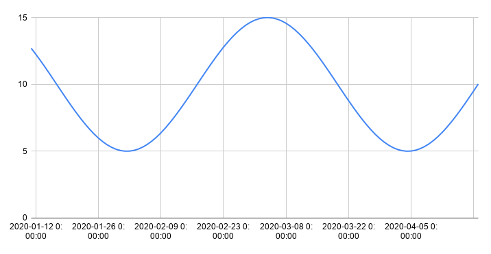
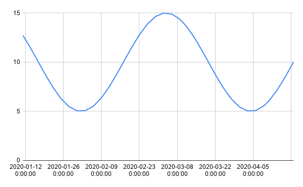
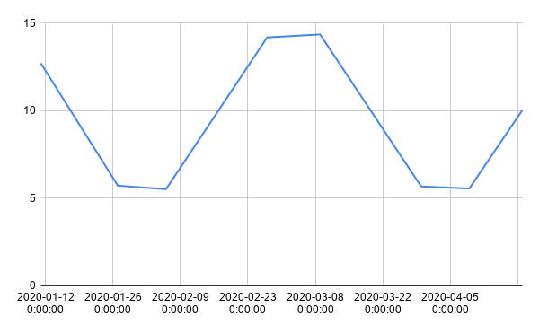

# Largest Triangle Three Buckets [<sup><mark>experimental</mark></sup>](/docs/README.md#tag-notes)

> [Description](#description)<br>
> [Example](#example)<br>
> [API](#api)

## Description <a id="description"></a>

[Largest Triangle Three Buckets](https://github.com/sveinn-steinarsson/flot-downsample)
is a downsampling method that tries to retain visual similarity between the
downsampled data and the original dataset. TimescaleDB Toolkit provides an
implementation of this which takes `(timestamp, value)` pairs, sorts them if
needed, and downsamples them.


## Usage Example <a id="details"></a>

In this example we're going to examine downsampling a 101 point cosine wave
generated like so

```SQL ,non-transactional
SET TIME ZONE 'UTC';
CREATE TABLE sample_data(time TIMESTAMPTZ, val DOUBLE PRECISION);
INSERT INTO sample_data
    SELECT
        '2020-01-01 UTC'::TIMESTAMPTZ + make_interval(days=>(foo*10)::int) as time,
        10 + 5 * cos(foo) as val
    FROM generate_series(1,11,0.1) foo
```
```output
INSERT 0 101
```

when graphed, this waves appears like so



we can downsample it to various degrees using `lttb`, for instance, downsampling
to 34 points

```SQL
SELECT time, value::numeric(10,2)
FROM toolkit_experimental.unnest_series((
    SELECT toolkit_experimental.lttb(time, val, 34)
    FROM sample_data))
```

<div hidden>

```output
          time          | value
------------------------+-------
 2020-01-11 00:00:00+00 | 12.70
 2020-01-13 00:00:00+00 | 11.81
 2020-01-15 00:00:00+00 | 10.85
 2020-01-19 00:00:00+00 |  8.86
 2020-01-22 00:00:00+00 |  7.48
 2020-01-25 00:00:00+00 |  6.31
 2020-01-28 00:00:00+00 |  5.48
 2020-01-31 00:00:00+00 |  5.05
 2020-02-03 00:00:00+00 |  5.06
 2020-02-06 00:00:00+00 |  5.52
 2020-02-09 00:00:00+00 |  6.37
 2020-02-12 00:00:00+00 |  7.55
 2020-02-15 00:00:00+00 |  8.95
 2020-02-20 00:00:00+00 | 11.42
 2020-02-23 00:00:00+00 | 12.77
 2020-02-26 00:00:00+00 | 13.88
 2020-02-29 00:00:00+00 | 14.64
 2020-03-03 00:00:00+00 | 14.98
 2020-03-06 00:00:00+00 | 14.88
 2020-03-09 00:00:00+00 | 14.35
 2020-03-11 00:00:00+00 | 13.77
 2020-03-14 00:00:00+00 | 12.63
 2020-03-17 00:00:00+00 | 11.26
 2020-03-22 00:00:00+00 |  8.78
 2020-03-25 00:00:00+00 |  7.40
 2020-03-28 00:00:00+00 |  6.26
 2020-03-31 00:00:00+00 |  5.44
 2020-04-03 00:00:00+00 |  5.04
 2020-04-06 00:00:00+00 |  5.08
 2020-04-09 00:00:00+00 |  5.55
 2020-04-11 00:00:00+00 |  6.10
 2020-04-14 00:00:00+00 |  7.20
 2020-04-17 00:00:00+00 |  8.54
 2020-04-20 00:00:00+00 | 10.02
```

</div>

```
output omitted
```

looks like so



as you further downsample, you retain fewer and fewer datapoints, and the
resulting data looks less and less like the original

```SQL
SELECT time, value::numeric(10,2)
FROM toolkit_experimental.unnest_series((
    SELECT toolkit_experimental.lttb(time, val, 17)
    FROM sample_data))
```
```output
          time          | value
------------------------+-------
 2020-01-11 00:00:00+00 | 12.70
 2020-01-13 00:00:00+00 | 11.81
 2020-01-22 00:00:00+00 |  7.48
 2020-01-28 00:00:00+00 |  5.48
 2020-02-03 00:00:00+00 |  5.06
 2020-02-09 00:00:00+00 |  6.37
 2020-02-14 00:00:00+00 |  8.46
 2020-02-24 00:00:00+00 | 13.17
 2020-03-01 00:00:00+00 | 14.80
 2020-03-07 00:00:00+00 | 14.75
 2020-03-13 00:00:00+00 | 13.04
 2020-03-23 00:00:00+00 |  8.30
 2020-03-29 00:00:00+00 |  5.94
 2020-04-04 00:00:00+00 |  5.00
 2020-04-10 00:00:00+00 |  5.80
 2020-04-14 00:00:00+00 |  7.20
 2020-04-20 00:00:00+00 | 10.02
```


```SQL
SELECT time, value::numeric(10,2)
FROM toolkit_experimental.unnest_series((
    SELECT toolkit_experimental.lttb(time, val, 8)
    FROM sample_data))
```
```output
          time          | value
------------------------+-------
 2020-01-11 00:00:00+00 | 12.70
 2020-01-27 00:00:00+00 |  5.72
 2020-02-06 00:00:00+00 |  5.52
 2020-02-27 00:00:00+00 | 14.17
 2020-03-09 00:00:00+00 | 14.35
 2020-03-30 00:00:00+00 |  5.67
 2020-04-09 00:00:00+00 |  5.55
 2020-04-20 00:00:00+00 | 10.02
```



## Command List (A-Z) <a id="api"></a>
> - [lttb](#lttb)

---
## **lttb** <a id="lttb"></a>
```SQL,ignore
toolkit_experimental.lttb(
    time TIMESTAMPTZ,
    value DOUBLE PRECISION,
    resolution INTEGER
) RETURNS SortedTimeseries
```

This will construct and return a sorted timeseries with at most `resolution`
points. `toolkit_experimental.unnest_series(...)` can be used to
extract the `(time, value)` pairs from this series

### Required Arguments <a id="lttb-required-arguments"></a>
|Name| Type |Description|
|---|---|---|
| `time` | `TIMESTAMPTZ` | Time (x) value for the data point. |
| `value` | `DOUBLE PRECISION` |  Data (y) value for the data point. |
| `resolution` | `INTEGER` | Number of points the output should have. |
<br>

### Sample Usage <a id="lttb-examples"></a>

```SQL
SELECT time, value
FROM toolkit_experimental.unnest_series((
    SELECT toolkit_experimental.lttb(time, val, 4)
    FROM sample_data))
```
```output
          time          |       value
------------------------+--------------------
 2020-01-11 00:00:00+00 |   12.7015115293407
 2020-02-01 00:00:00+00 |  5.004324248633603
 2020-03-03 00:00:00+00 | 14.982710485116087
 2020-04-20 00:00:00+00 | 10.022128489940254
```